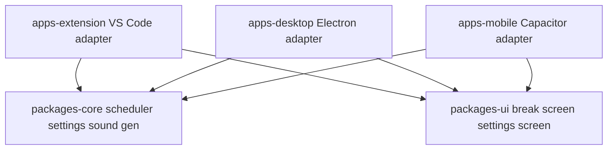

# Eyesbreaker — Desktop + Mobile Architecture Plan

## Goal

Reuse the 20-20-20 reminder logic, settings UI, countdown popup, and annoying
sound across three targets:

1. **VS Code extension** (current codebase)
2. **Desktop app** — Electron for Windows, macOS, Linux
3. **Mobile app** — Capacitor shell around the same web UI for iOS and Android

Electron cannot run on mobile, so mobile uses Capacitor with the shared web UI
and native plugins for notifications and sound.

## Architecture overview



The rule is: **only the thin platform adapter changes**. The core and UI stay
identical everywhere.

## Repository layout

```text
eyesbreaker/
  package.json                 # npm workspaces root
  packages/
    core/                      # framework-free TypeScript
      src/
        settings.ts            # EyeBreakSettings type + defaults
        scheduler.ts           # EyeBreakScheduler heartbeat + countdown
        sound.ts               # generateAlarmWav pure WAV generator
        platform.ts            # PlatformAdapter interface
        index.ts
    ui/                        # shared web UI, framework-agnostic
      src/
        break-screen.ts        # 20-second countdown screen
        settings-screen.ts     # settings form from settingsWebviewProvider
  apps/
    extension/                 # current VS Code extension, refactored
      src/extension.ts         # thin VS Code adapter
      package.json
    desktop/                   # Electron app
      src/main.ts
      src/preload.ts
      src/windows.ts
      src/platform.ts          # electron-store + Web Audio adapter
    mobile/                    # Capacitor app
      src/
      capacitor.config.ts
      platform.ts              # Preferences + local notifications adapter
```

The current files stay conceptually the same but are moved/refactored:

| Current file | Becomes |
| --- | --- |
| [`src/settings.ts`](../src/settings.ts) | `packages/core/src/settings.ts` |
| [`src/extension.ts`](../src/extension.ts) timer/scheduling logic | `packages/core/src/scheduler.ts` |
| [`src/sound.ts`](../src/sound.ts) WAV generation | `packages/core/src/sound.ts` |
| [`src/breakReminderPanel.ts`](../src/breakReminderPanel.ts) HTML | `packages/ui/src/break-screen.ts` |
| [`src/settingsWebviewProvider.ts`](../src/settingsWebviewProvider.ts) HTML | `packages/ui/src/settings-screen.ts` |

## Shared core — `packages/core`

### `EyeBreakSettings`

```ts
interface EyeBreakSettings {
    enabled: boolean;          // default true
    intervalMinutes: number;   // default 20
    breakSeconds: number;      // default 20
    soundEnabled: boolean;     // default true
    soundVolume: number;       // default 1
    soundPattern: 'alarm' | 'beep' | 'siren';
    snoozeMinutes: number;     // default 5
}
```

### `EyeBreakScheduler`

Platform-agnostic replacement for the timers currently in
[`src/extension.ts`](../src/extension.ts):

```ts
class EyeBreakScheduler {
    start(settings: EyeBreakSettings): void;
    stop(): void;
    startBreakNow(): void;
    dismissBreak(): void;
    snoozeBreak(minutes: number): void;
    getState(): SchedulerState;
    onTick(callback: (state: SchedulerState) => void): void;
    onBreakStart(callback: () => void): void;
    onBreakEnd(callback: (reason: 'completed' | 'dismissed' | 'snoozed') => void): void;
}
```

`SchedulerState` carries:

- `phase: 'idle' | 'break'`
- `nextBreakInMs: number`
- `remainingBreakSeconds: number`

The scheduler runs a 1-second heartbeat exactly like the extension does today,
but it never touches VS Code, Electron, or Capacitor APIs. The platform adapter
reacts to the scheduler callbacks.

### `generateAlarmWav`

The WAV generation from [`src/sound.ts`](../src/sound.ts) moves here unchanged
as a pure function returning a `Uint8Array`. Every platform then decides how to
play those bytes:

- **VS Code** — keep the current OS-player adapter.
- **Electron** — convert to a Blob/data URL and play with Web Audio.
- **Mobile** — bundle a pre-generated WAV and play through a native audio
  plugin, or rely on the local notification sound.

### `PlatformAdapter`

```ts
interface PlatformAdapter {
    loadSettings(): Promise<EyeBreakSettings>;
    saveSettings(settings: EyeBreakSettings): Promise<void>;
    playSound(pattern: SoundPattern, volume: number): Promise<void>;
    scheduleLocalNotifications?(settings: EyeBreakSettings): Promise<void>;
}
```

## Desktop app — `apps/desktop`

Electron is the natural desktop target because the break screen and settings
screen are already HTML.

### Main process

- Creates a **hidden scheduler window** (or keeps the scheduler in the main
  process) that hosts `EyeBreakScheduler`.
- Owns two `BrowserWindow`s:
  1. **Break window** — frameless, always-on-top, centered, auto-closes after
     20 seconds. Reuses `packages/ui/break-screen`.
  2. **Settings window** — reuses `packages/ui/settings-screen`.
- Keeps a **tray icon** with: Start Break, Open Settings, Enable/Disable, Quit.
- Persists settings with `electron-store` through the desktop platform adapter.

### Sound

Electron BrowserWindows use `webPreferences.autoplayPolicy =
'no-user-gesture-required'`, so the shared WAV generator can play through
Web Audio automatically when the break window opens. This removes the
PowerShell workaround needed in the extension.

### Desktop-specific notes

- `alwaysOnTop` + `skipTaskbar` makes the break feel like a popup.
- `app.setLoginItemSettings` can auto-start the app at login.
- Packaging with `electron-builder` for Windows, macOS, Linux.

## Mobile app — `apps/mobile`

Capacitor wraps the shared web UI into native iOS/Android apps.

### Foreground behavior

While the app is open, `EyeBreakScheduler` runs the same heartbeat and shows the
same break screen. Sound plays through Web Audio or a native audio plugin.

### Background behavior

Mobile operating systems throttle JavaScript timers and webview background
execution, so the reliable approach is:

1. When settings change or a break ends, call
   `scheduleLocalNotifications(settings)` on the platform adapter.
2. The adapter uses `@capacitor/local-notifications` to schedule future
   notifications at 20-minute intervals with an annoying system sound.
3. When the app returns to the foreground, `EyeBreakScheduler` recomputes state
   from the wall clock and resumes.

### Sound

- iOS/Android local notifications play the device notification sound, which is
  the most reliable "annoying" option in the background.
- In the foreground, use `@capacitor-community/native-audio` with a bundled
  WAV generated by `generateAlarmWav`.

### Mobile plugins

- `@capacitor/local-notifications`
- `@capacitor/preferences` for settings storage
- `@capacitor/app` for app state (foreground/background)
- `@capacitor-community/native-audio` for foreground sound

## Shared UI — `packages/ui`

Extract the two existing HTML screens into framework-agnostic web components or
plain template functions:

1. **Break screen** — countdown, progress bar, Dismiss, Snooze, Replay sound.
2. **Settings screen** — toggles, number inputs, pattern select, volume slider,
   Restore Defaults, Test Break.

Both screens communicate with the platform through a tiny message interface, so
VS Code webviews, Electron windows, and the Capacitor webview all render the
same markup.

## Refactor of the VS Code extension

The extension becomes a thin adapter:

- [`src/extension.ts`](../src/extension.ts) instantiates `EyeBreakScheduler`
  from core, registers VS Code commands, and updates the status bar.
- [`src/breakReminderPanel.ts`](../src/breakReminderPanel.ts) and
  [`src/settingsWebviewProvider.ts`](../src/settingsWebviewProvider.ts) render
  the shared UI screens instead of duplicating HTML.
- [`src/sound.ts`](../src/sound.ts) keeps only the OS-player portion; WAV
  generation imports from core.

This guarantees the extension, desktop, and mobile versions never drift.

## Build and release

- Root `package.json` uses npm workspaces.
- `packages/core` and `packages/ui` build first with TypeScript.
- `apps/extension` keeps `vsce package`.
- `apps/desktop` uses `electron-builder`.
- `apps/mobile` uses Capacitor CLI + Android Studio / Xcode.

## Implementation order

1. Set up npm workspaces root and move shared code into `packages/core`.
2. Create `packages/ui` with the extracted break and settings screens.
3. Refactor the VS Code extension to use core + UI and verify it still runs.
4. Scaffold the Electron desktop app and its platform adapter.
5. Implement the Electron break window, tray, settings window, and sound.
6. Scaffold the Capacitor mobile app and its platform adapter.
7. Implement local notifications and native sound on mobile.
8. Configure `electron-builder` and Capacitor builds for all targets.
9. Document how to run and package each target.

## Key risks

- **Mobile background limits** — never rely on JS timers in the background;
  always use local notifications.
- **Notification permissions** — iOS requires the user to grant notification
  permission; request it on first settings save.
- **Electron autoplay** — set `autoplayPolicy` explicitly or sound may be
  blocked like the earlier webview issue.
- **Single source of truth** — settings must flow through `PlatformAdapter`
  only, never through platform-specific storage directly.
